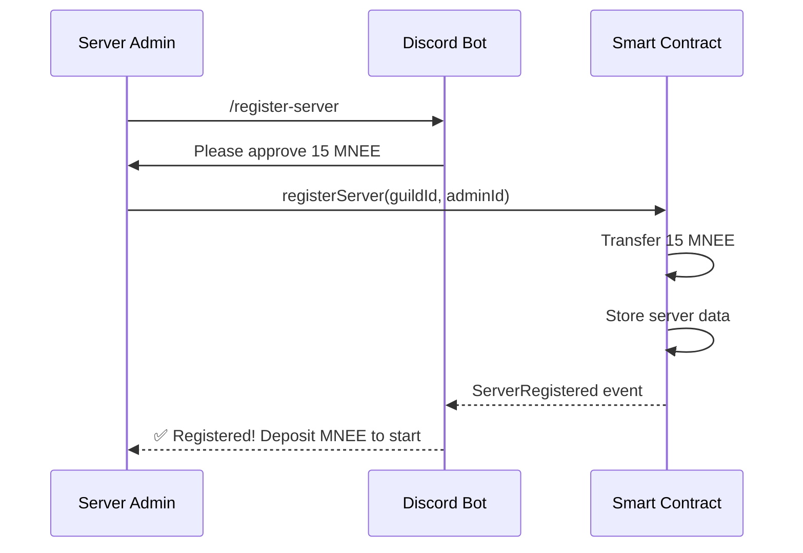
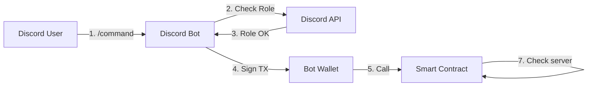
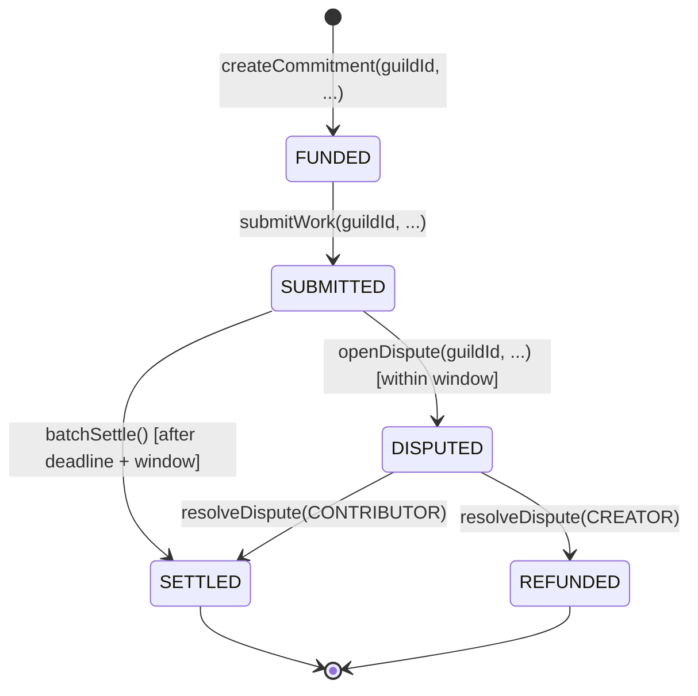

# Commit Protocol - Complete Technical Guide

> **Optimistic Agentic Settlement for On-Chain Work Commitments with Discord Integration**

## Table of Contents

1. [Overview](#overview)
2. [Discord Integration](#discord-integration)
3. [Core Concepts](#core-concepts)
4. [Protocol Architecture](#protocol-architecture)
5. [Smart Contract Specification](#smart-contract-specification)
6. [Dynamic Stake Calculation](#dynamic-stake-calculation)
7. [Workflow Examples](#workflow-examples)
8. [Security Model](#security-model)
9. [Deployment Guide](#deployment-guide)

---

## Overview

### What is Commit Protocol?

Commit Protocol is a **trustless escrow system** for work commitments that combines:
- **Smart contract escrow** (MNEE ERC-20 tokens on Ethereum)
- **Discord server integration** (prepaid balance system)
- **AI-powered verification** (automated code review, testing, spec compliance)
- **Optimistic settlement** (automatic release via cron job unless disputed)
- **Dynamic economic security** (stake based on reputation + AI confidence)

### Token

- **Token**: MNEE (ERC-20)
- **Address**: `0x8ccedbAe4916b79da7F3F612EfB2EB93A2bFD6cF`
- **Network**: Ethereum Mainnet
- **Decimals**: 18
- **Testing**: Fork mainnet using Anvil (no testnet available)

### Problem Statement

Discord communities and DAOs struggle with:
- ❌ Manual payment releases (slow, requires multisig)
- ❌ Separate payment wallets per user (complex UX)
- ❌ Subjective "done" definitions (endless disputes)
- ❌ Fixed dispute costs (too expensive for small tasks, too cheap for large ones)
- ❌ No reputation tracking (same treatment for proven vs. new contributors)

### Solution

Commit Protocol provides:
- ✅ **Discord server registration** - Pay 15 MNEE to register server
- ✅ **Prepaid balance system** - Server manages one MNEE balance for all commitments
- ✅ **Secure relayer pattern** - Bot wallet is the only caller, verifies Discord roles
- ✅ **Automatic settlement** via cron job after deadline + dispute window
- ✅ **AI verification** defines objective "done" criteria
- ✅ **Dynamic stakes** scale with task value, reputation, and AI confidence
- ✅ **Reputation vectors** reward consistent contributors

---

## Discord Integration

### Registration Flow



### Balance Management

Each Discord server has a prepaid MNEE balance tracked on-chain:

| Field | Description |
|-------|-------------|
| `totalDeposited` | Lifetime MNEE deposited (never decreases) |
| `totalSpent` | Lifetime MNEE spent on commitments |
| `availableBalance` | Current spendable balance |

**Invariant:** `availableBalance = totalDeposited - totalSpent`

### Role-Based Access Control

The protocol uses **Discord roles** verified off-chain by the bot:

1. **Server Admin** (`adminDiscordId`)
   - Registered during server registration
   - Can deposit/withdraw MNEE balance
   
2. **commit-creator** (Discord role)
   - Configured in Discord server settings
   - Can create commitments using server balance
   - Bot verifies role before allowing contract call

3. **Contributors**
   - Any Discord user with wallet
   - Can submit work and receive payments

### Security Model



**Trust Assumptions:**
- **Bot private key** is secure (only way to call contract)
- **Discord API** correctly reports user roles
- **Contract trusts relayer** to have verified permissions

**Security guarantees:**
- ✅ Only registered servers can create commitments
- ✅ Only relayer wallet can call protected functions
- ✅ Server balance prevents overspending
- ✅ No on-chain role storage reduces gas costs

---

## Core Concepts

### 1. Commitment Lifecycle



#### State Definitions

| State | Description | Who Can Trigger |
|-------|-------------|-----------------|
| **FUNDED** | MNEE deducted from server balance, commitment created | Relayer (via bot) |
| **SUBMITTED** | Contributor submitted work + evidence CID | Relayer (via bot) |
| **DISPUTED** | Creator opened dispute with required stake | Relayer (via bot) |
| **SETTLED** | Funds released to contributor | Owner (cron job) |
| **REFUNDED** | Funds returned to server balance | Arbitrator |

**Note:** CREATED state removed - commitments are FUNDED immediately upon creation from server balance.

---

## Smart Contract Specification

### Core Interface

```solidity
// SPDX-License-Identifier: MIT
pragma solidity ^0.8.20;

interface ICommit {
    enum State { CREATED, FUNDED, SUBMITTED, DISPUTED, SETTLED, REFUNDED }
    
    struct ServerData {
        uint256 guildId;
        uint256 adminDiscordId;
        bool isActive;
        uint256 registeredAt;
        uint256 totalDeposited;
        uint256 totalSpent;
        uint256 availableBalance;
    }
    
    struct CommitmentData {
        address creator;          // Bot wallet (relayer)
        address contributor;
        address token;
        uint256 amount;
        uint256 deadline;
        uint256 disputeWindow;
        string specCid;
        string evidenceCid;
        State state;
        uint256 createdAt;
        uint256 submittedAt;
    }
    
    // Server management
    function registerServer(uint256 _guildId, uint256 _adminDiscordId) external;
    function depositToServer(uint256 _guildId, uint256 _amount) external;
    function withdrawFromServer(uint256 _guildId, address _to, uint256 _amount) external;
    
    // Commitment lifecycle (all require guildId + relayer)
    function createCommitment(
        uint256 _guildId,
        address _contributor,
        address _token,
        uint256 _amount,
        uint256 _deadline,
        uint256 _disputeWindow,
        string calldata _specCid
    ) external returns (uint256 commitId);
    
    function submitWork(
        uint256 _guildId,
        uint256 _commitId,
        string calldata _evidenceCid
    ) external;
    
    function openDispute(uint256 _guildId, uint256 _commitId) external;
    
    // Settlement (relayer only - for cron job)
    function settle(uint256 _commitId) external;
    function batchSettle(uint256[] calldata _commitIds) external;
    
    // Arbitration
    function resolveDispute(uint256 _commitId, bool _favorContributor) external;
    
    // View functions
    function getServerBalance(uint256 _guildId) external view returns (
        uint256 totalDeposited,
        uint256 totalSpent,
        uint256 availableBalance
    );
    function getCommitment(uint256 _commitId) external view returns (CommitmentData memory);
}
```

### Key Events

```solidity
event ServerRegistered(uint256 indexed guildId, uint256 adminDiscordId);
event ServerDeposited(uint256 indexed guildId, uint256 amount, uint256 newBalance);
event ServerWithdrew(uint256 indexed guildId, address to, uint256 amount);
event ServerDeactivated(uint256 indexed guildId);

event CommitmentCreated(
    uint256 indexed commitId,
    address indexed creator,
    address indexed contributor,
    address token,
    uint256 amount,
    uint256 deadline
);

event WorkSubmitted(uint256 indexed commitId, string evidenceCid, uint256 timestamp);
event CommitmentSettled(uint256 indexed commitId, address indexed recipient, uint256 amount, uint256 timestamp);
```

---

## Deployment Guide

### Prerequisites

- Foundry installed
- Ethereum RPC URL (Alchemy/Infura)
- MNEE tokens for registration fees
- Private key for deployer wallet

### Local Deployment (Anvil Fork)

```bash
cd contracts

# Start Anvil with mainnet fork
./scripts/start-anvil.sh

# Fund test wallet with MNEE
./scripts/fund-test-wallet.sh 10000 0xf39Fd6e51aad88F6F4ce6aB8827279cffFb92266

# Deploy contract
forge script script/DeployLocal.s.sol:DeployLocal \
  --rpc-url http://localhost:8545 \
  --broadcast

# Set relayer (bot wallet)
cast send $CONTRACT_ADDRESS "setRelayer(address)" $BOT_WALLET_ADDRESS \
  --rpc-url http://localhost:8545 \
  --private-key $OWNER_PRIVATE_KEY

# Register a test server
cast send $CONTRACT_ADDRESS "registerServer(uint256,uint256)" 123456789 987654321 \
  --rpc-url http://localhost:8545 \
  --private-key $SERVER_ADMIN_KEY
```

### Mainnet Deployment

```bash
# Configure .env
ETH_MAINNET_RPC_URL=https://eth-mainnet.g.alchemy.com/v2/YOUR_KEY
PRIVATE_KEY=0x...
ARBITRATOR_ADDRESS=0x...

# Deploy
forge script script/Deploy.s.sol:DeployMainnet \
  --rpc-url $ETH_MAINNET_RPC_URL \
  --broadcast \
  --verify \
  --etherscan-api-key $ETHERSCAN_API_KEY
```

---

## Testing

All tests use the new Discord server integration model:

```bash
cd contracts

# Run all tests
forge test -vv

# Specific test
forge test --match-test testRegisterServer -vvvv

# Gas report
forge test --gas-report
```

**Test Coverage:**
- ✅ Server registration (15 MNEE fee)
- ✅ Balance deposit/withdrawal
- ✅ Commitment creation with balance deduction
- ✅ Insufficient balance protection
- ✅ Relayer access control
- ✅ Batch settlement
- ✅ Admin functions

---

**Built with**: Solidity • TypeScript • Node.js • Discord.js • PostgreSQL • Prisma • Foundry • OpenZeppelin

*For the complete dynamic stake formula and AI integration details, see sections 5-7 in the original PROTOCOL.md*
